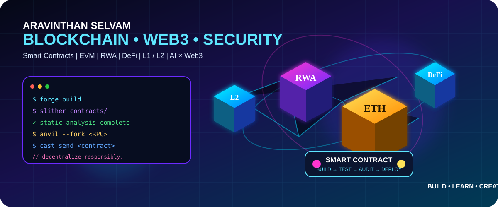

<div align="center">



# ⛓️ ARAVINTHAN SELVAM
### 🧊 Blockchain Developer • Web3 Engineer • Smart Contract Security

**Building decentralized systems from Smart Contract → EVM → Network → DApp**

[](https://github.com/Aravinth1228)
[](https://soliditylang.org/)
[](https://ethereum.org/)
[](https://book.getfoundry.sh/)

</div>

## 🌌 ABOUT ME

I'm focused on **Blockchain & Web3 engineering**, with an end-to-end mindset: architecture, smart contracts, testing, security, deployment and blockchain infrastructure.

```text
              WEB3 / BLOCKCHAIN ENGINEERING
                         │
       ┌─────────────────┼─────────────────┐
       ▼                 ▼                 ▼
  SMART CONTRACT       EVM            BLOCKCHAIN
  Solidity             Gas             Nodes / RPC
  OpenZeppelin         ABI             Geth / Besu
  ERC Standards        Events          Explorers
       │                 │                 │
       └─────────────────┼─────────────────┘
                         ▼
                 DAPP / PROTOCOL
                         │
                 Security • Scale
```

## 🧠 CORE BLOCKCHAIN SKILLS

| 🧩 Domain | ⚡ Technologies / Concepts |
|---|---|
| **Smart Contracts** | Solidity • OpenZeppelin • ERC-20 • ERC-721 • ERC-1155 • Access Control • Upgradeable Proxies |
| **EVM** | EVM execution • ABI • Gas • Events • Logs • Transactions • Contract Storage |
| **Networks** | Ethereum • BNB Chain • Polygon • Base • Sepolia • EVM-compatible chains |
| **L1 / L2** | Layer 1 • Layer 2 • Bridges • RPC • Nodes • Cross-chain concepts |
| **RWA / DeFi** | Tokenization • Real Estate • Staking • Presale • DeFi protocol logic |
| **Security** | Slither • Foundry tests • Fuzzing • Reentrancy • Access Control • Business Logic |

## 🛠️ 3D BLOCKCHAIN TOOLKIT

> A visual-first stack for building blockchain experiences, dashboards and Web3 interfaces.

<div align="center">


</div>

### 🔮 Visual Web3 Flow

```text
3D Interface
     ↓
Three.js / React Three Fiber
     ↓
Wallet ── MetaMask / WalletConnect
     ↓
Viem / Ethers.js
     ↓
Smart Contract
     ↓
EVM
     ↓
RPC / Node
     ↓
Ethereum • BNB • Polygon • Base
```

## 🔐 SMART CONTRACT SECURITY

<div align="center">


</div>

**Security areas:**

`Reentrancy` · `Access Control` · `Authorization` · `Oracle Risk` · `Signature Validation` · `Precision` · `Business Logic` · `Upgradeable Contracts` · `Denial of Service`

## 🌍 BLOCKCHAIN INFRASTRUCTURE


**Infrastructure concepts:** Nodes • RPC endpoints • Genesis configuration • Peer-to-peer networking • Validators • Block explorers • Indexing • Dockerized deployments

## 🌐 WEB3 DEVELOPMENT


## 🚀 WHAT I'M BUILDING

### 🏦 RWA & Real Estate
Tokenization, on-chain ownership, asset representation and blockchain-based investment concepts.

### 💰 DeFi
Staking, token systems, presale contracts, transfers and protocol-level business logic.

### 🛡️ AI × Smart Contract Security
Exploring **AI-assisted contract analysis and automated auditing**, combining static analysis, testing and LLM-based reasoning.

### 🧱 Blockchain Infrastructure
Exploring **Geth, Hyperledger Besu, RPC, explorers, L1/L2 architecture and private/EVM networks**.

## 📦 FEATURED PROJECT AREAS

| Project | Focus |
|---|---|
| 🏠 **RWA-Real-Estate** | Real-world asset tokenization |
| ⛓️ **Blockchain-Project** | End-to-end blockchain implementation |
| 🟡 **BEP-20-Transaction-System** | Token transfers and BSC concepts |
| 🗳️ **Voting-system-using-Block-Chain** | Decentralized voting |
| 🔗 **layer1-to-layer2** | L1 / L2 concepts and bridging |
| 🧪 **ERC20-transferFrom-Blockchain** | ERC-20 contract interaction |

## 🧭 ENGINEERING PATH

```text
Solidity
   ↓
Smart Contract Architecture
   ↓
Foundry + Hardhat
   ↓
Slither + Fuzz Testing
   ↓
DeFi / RWA Protocols
   ↓
EVM Internals
   ↓
Geth / Besu / RPC / Nodes
   ↓
L1 / L2 + Interoperability
   ↓
AI-Powered Smart Contract Auditing
```

## 📊 GITHUB

<div align="center">


</div>

## ⚡ CURRENT FOCUS

`Smart Contracts` `Web3` `EVM` `RWA` `DeFi` `L1/L2` `Geth` `Besu` `Foundry` `Slither` `AI Security`

<div align="center">

### 💜 BUILD ON-CHAIN • THINK IN SYSTEMS • SECURE BY DESIGN 💙

**Code Today → Decentralize Tomorrow → Build the Future 🚀**

</div>
