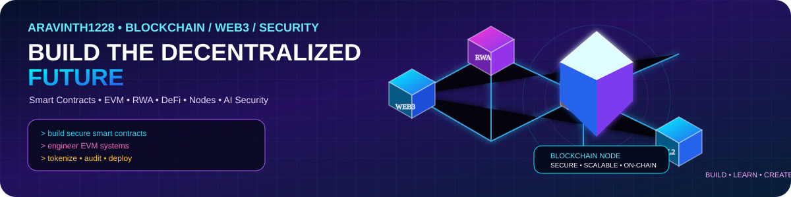
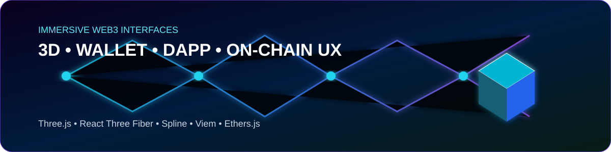
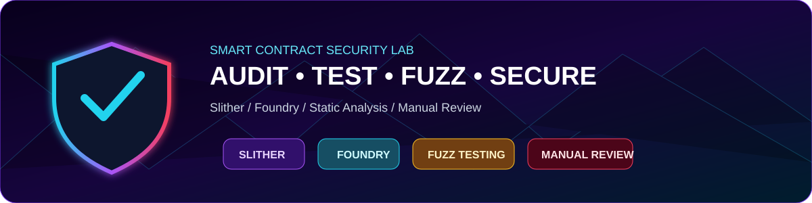
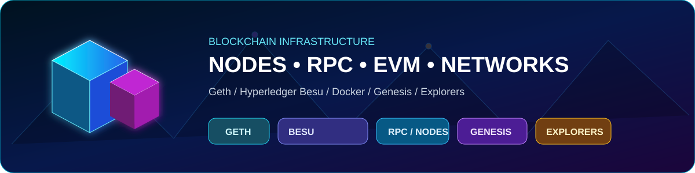

<div align="center">



# 🌌 ARAVINTHAN SELVAM
### 🔮 Blockchain Developer • Web3 Engineer • Smart Contract Security

**Building secure, scalable and real-world decentralized systems.**


</div>

## 🧬 ABOUT ME

> 🌈 **Blockchain is not just a contract. It's an entire system.**

I'm a **Blockchain / Web3 Developer** focused on the complete on-chain lifecycle — from smart-contract architecture and security to EVM execution, nodes, RPC, deployment and decentralized applications.

```text
                         🌐 WEB3
                           │
              ┌────────────┼────────────┐
              ▼            ▼            ▼
           💎 DApp      🔐 Contract   🧱 Network
           React        Solidity      Geth / Besu
              │            │            │
              └────────────┼────────────┘
                           ▼
                      ⚡ EVM LAYER
                           │
                           ▼
                 ⛓️ BLOCKCHAIN NETWORK
                           │
              ETH • BNB • BASE • POLYGON
```

## 💎 CORE BLOCKCHAIN SKILLS

| 🚀 Area | 🧠 What I Work With |
|---|---|
| 🔐 **Smart Contracts** | Solidity • OpenZeppelin • ERC-20 • ERC-721 • ERC-1155 • Proxy Patterns |
| ⚡ **EVM** | ABI • Gas • Storage • Events • Logs • Transactions • Execution |
| 🌐 **Networks** | Ethereum • BNB Chain • Polygon • Base • Sepolia • EVM Chains |
| 🏦 **RWA / DeFi** | Tokenization • Real Estate • Staking • Presale • Protocol Logic |
| 🛡️ **Security** | Slither • Foundry • Fuzzing • Reentrancy • Access Control • Business Logic |
| 🧱 **Infrastructure** | Geth • Hyperledger Besu • RPC • Nodes • Genesis • Explorers |

## 🌈 TECH STACK

### 🧠 Smart Contract Engineering


### 🌐 Web3 Development


### 🧪 Security & Testing


### 🧱 Blockchain Infrastructure


## 🧊 3D BLOCKCHAIN TOOLKIT



<div align="center">


</div>

### 🔮 Visual Web3 Flow

```text
3D Interface → Wallet → Viem / Ethers → Smart Contract → EVM → RPC / Node → Blockchain
```

## 🛡️ SMART CONTRACT SECURITY



```text
CODE → STATIC ANALYSIS → UNIT TESTS → FUZZING → MANUAL REVIEW → 🚀 DEPLOY
```

**Security focus:** `Reentrancy` · `Access Control` · `Authorization` · `Oracle Risks` · `Signature Validation` · `Precision` · `Business Logic` · `Upgradeable Contracts` · `DoS`

## 🌍 BLOCKCHAIN INFRASTRUCTURE



**Node → RPC → EVM → Transaction Pool → Consensus → Block → Explorer**

- 🟢 **Geth** — Ethereum execution/client concepts
- 🔵 **Hyperledger Besu** — EVM-compatible enterprise/private networks
- 🟣 **RPC** — application-to-node communication
- 🟠 **Genesis** — custom network configuration
- 🟦 **Docker** — reproducible blockchain infrastructure
- 🟢 **IPFS / The Graph** — decentralized storage and indexing

## 🏦 WHAT I'M BUILDING

### 🏠 RWA & Real Estate
Real-world asset tokenization, on-chain ownership and blockchain-based investment concepts.

### 💰 DeFi
Staking, token systems, presale contracts, transfers and protocol-level business logic.

### 🤖 AI × Smart Contract Security
AI-assisted vulnerability detection, contract analysis and automated auditing workflows.

### 🌉 L1 / L2 & Interoperability
Execution layers, bridges, RPC infrastructure and cross-chain systems.

## 🚀 FEATURED BLOCKCHAIN WORK

| 🔥 Project | 🎯 Focus |
|---|---|
| 🏠 **RWA-Real-Estate** | Real-world asset tokenization |
| ⛓️ **Blockchain-Project** | End-to-end blockchain implementation |
| 🟡 **BEP-20-Transaction-System** | Token transfer & BSC concepts |
| 🗳️ **Voting-system-using-Block-Chain** | Decentralized voting |
| 🔗 **layer1-to-layer2** | L1 / L2 & bridge concepts |
| 🧪 **ERC20-transferFrom-Blockchain** | ERC-20 contract interaction |

## 🧭 MY BLOCKCHAIN ROADMAP

```text
Solidity → Smart Contracts → EVM → Foundry → Security / Audit
                     ↓
               DeFi + RWA
                     ↓
             Geth + Besu + RPC
                     ↓
               L1 / L2 Systems
                     ↓
             🤖 AI × Web3 Security
```

## 📊 GITHUB ACTIVITY

<div align="center">


</div>

<div align="center">

### 💜 BUILD ON-CHAIN • THINK IN SYSTEMS • SECURE BY DESIGN 💙

**Code Today → Decentralize Tomorrow → Build the Future 🚀**

</div>
